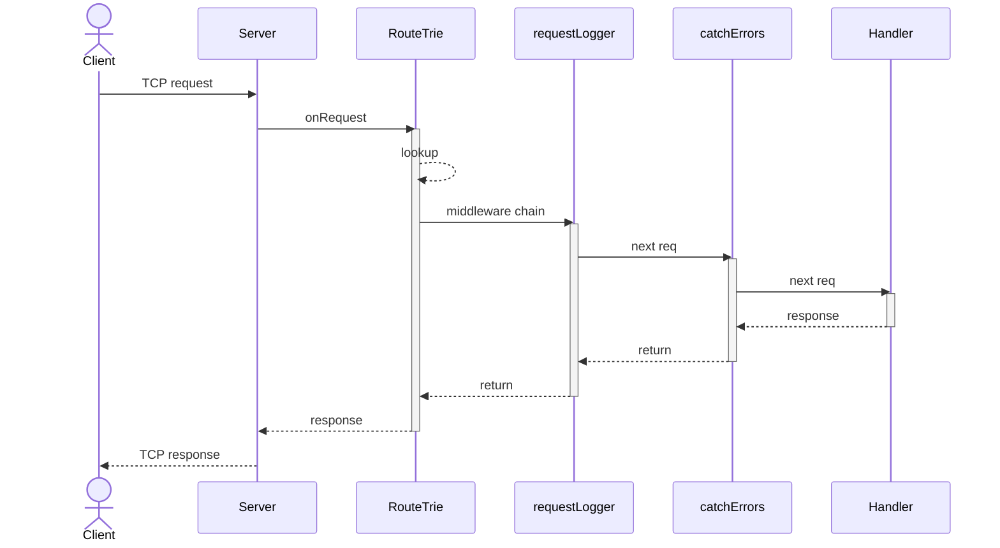
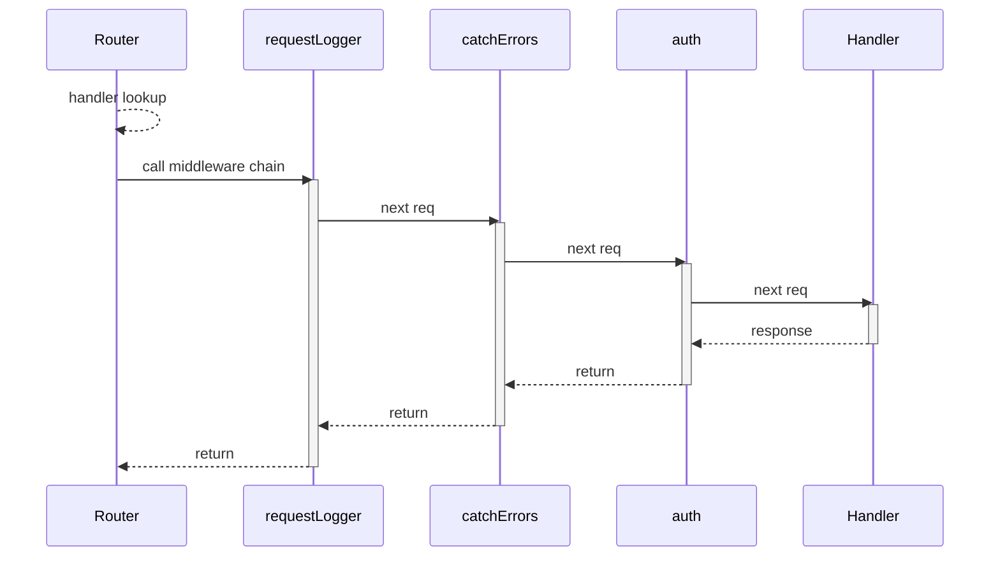
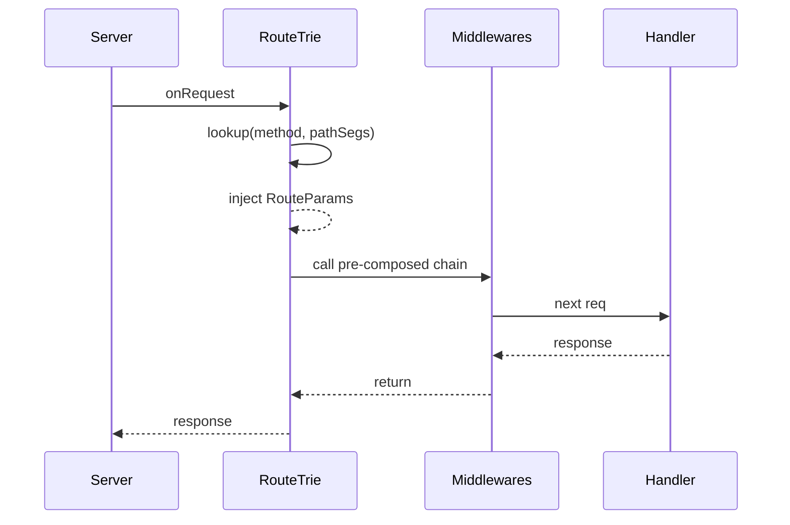

<div align="center">

# LeanIO

[](https://lean-lang.org/)
[](https://github.com/leanprover/lake)
[](./lakefile.toml)
[](./LICENSE)

A composable HTTP toolkit for Lean 4. Built on `Std.Http.Server` with an
axum-inspired extractor DSL, middleware chaining, and sub-router mounting.

</div>

## Highlights

- ⚡ **Route macros** — 41 HTTP methods as term macros with compile-time pattern validation
- 🧩 **Extractors** — typed parameters injected into handlers: `Path Nat`, `Json T`, `Query T`, `Form α`, `MultiPartForm`
- 📤 **Streaming uploads** — zero-copy multipart parser
- 📁 **File serving** — `File` streams from disk with MIME detection; `RangeFile` adds `206 Partial Content` and `Accept-Ranges`
- 🏷️ **ETag caching** — `CacheControl` directives with presets; weak ETags for files (mtime+size) and JSON (String.hash)
- 🧪 **Middlewares** — wraps both request and response; built-in logging, error catching, and auth
- 🏗️ **Router composition** — segment trie with O(depth) lookup, literal > param > wildcard priority, sub-routers merged at serve time
- 🎯 **IntoResponse** — return `String`, `Status × T`, `Except ε α`, `File`, or implement your own — all streamed, never buffered
- 🚀 **Deriving** — `FromPath`, `FromQuery`, `FromForm` auto-generated from struct field names

## Contents

1. [Overview](#1-overview)
2. [Routes](#2-routes)
3. [Extractors](#3-extractors)
4. [Responses](#4-responses)
5. [Middleware](#5-middleware)
6. [Router](#6-router)
7. [Reference](#7-reference)

---

## 1. Overview

This chapter walks through building a complete application — a REST API for a task list,
with a browser frontend served from disk. Every concept is presented in context first;
later chapters provide the full API reference.

### 1.1 A complete application

```lean
import LeanIO
open LeanIO.Router
open LeanIO.Middlewares
open Std Http Server
open Std Async
open Lean

set_option linter.unusedVariables false

/- Data model -/

structure Todo where
  title     : String
  completed : Bool := false
deriving Inhabited, ToJson, FromJson

structure TodoStore where
  todos : Array Todo
deriving Inhabited

/- State (shared via middleware) -/

structure AppState where
  ref : IO.Ref TodoStore
deriving TypeName

instance : FromRequestParts AppState where
  from_request_parts req :=
    match req.extensions.get AppState with
    | some s => .ok s
    | none   => .error "state not installed"

/- Routes -/

def listTodos := GET "/api/todos" (⟨state⟩ : AppState) => do
    let store ← state.get
    return store.todos

def addTodo := POST "/api/todos" (⟨body⟩ : Json Todo) (⟨state⟩ : AppState) => do
    let store ← state.get
    state.set { store with todos := store.todos.push body }
    return (Status.created, body)

def toggleTodo := PATCH "/api/todos/{id}" (⟨state⟩ : AppState) (⟨id⟩ : Path Nat) => do
    let store ← state.get
    if h : id < store.todos.size then
      let t := store.todos[id]!
      state.set { store with todos := store.todos.set id {t with completed := ¬t.completed} }
      return Except.ok (Status.ok)
    else
      return Except.error (Status.notFound, s!"todo {id} not found")

def deleteTodo := DELETE "/api/todos/{id}" (⟨state⟩ : AppState) (⟨id⟩ : Path Nat) => do
    let store ← state.get
    if h : id < store.todos.size then
      state.set { store with todos := store.todos.eraseIdx id }
      return Except.ok (Status.ok)
    else
      return Except.error (Status.notFound, s!"todo {id} not found")

/- Frontend — serve a SPA from disk -/

def serveUI := GET "/{*rest}" (⟨rest⟩ : Path String) => do
    let path : System.FilePath := "public" / rest
    return { path : RangeFile }

/- Entry point -/

def main : IO Unit := Async.block do
  let ref ← IO.mkRef { todos := #[] : TodoStore }
  let router := Router.empty
    |>.addRoute listTodos
    |>.addRoute addTodo
    |>.addRoute toggleTodo
    |>.addRoute deleteTodo
    |>.addRoute serveUI
    |>.addMiddleware (withExtension AppState { ref })
    |>.addMiddleware catchErrors
    |>.addMiddleware requestLogger
  let addr : Net.SocketAddress := .v4 ⟨.ofParts 127 0 0 1, 8080⟩
  let server ← router.serve addr
  IO.println "Listening on http://127.0.0.1:8080"
  server.waitShutdown
```

This single file contains:

- **Route definitions** — four CRUD endpoints under `/api/todos` and a catch-all
  that serves static files from the `public/` directory.
- **Extractors** — `(⟨body⟩ : Json Todo)` deserializes the JSON body; `(⟨id⟩ : Path Nat)`
  pulls path parameters; `(⟨state⟩ : AppState)` destructures the middleware state to
  the `IO.Ref` directly; `(⟨rest⟩ : Path String)` captures the wildcard path.
- **Responses** — handlers return `ToJson` values, `Status × T` tuples, or `Except`
  for fallible results. `{ path : RangeFile }` streams files from disk with HTTP Range
  support for video and partial requests.
- **Middleware** — `withExtension` installs the shared store; `catchErrors` catches
  exceptions from downstream; `requestLogger` logs every request with its response
  status code and timing.

### 1.2 The router pipeline

`Router.serve` compiles the router into a `RouteTrie`, pre-composing every
middleware chain around its handler. At request time the trie looks up the
matching pipeline and runs it — no composition happens per request. The
response flows back through every middleware before being returned:



Middlewares are composed around the handler at serve time with `foldl`
(last added runs outermost). Each middleware sees the request on the way in
and the response on the way out.

Extractors run as part of handler invocation — route parameters are captured from
the path during trie lookup and stored in request extensions. Body extractors read
from the underlying `Body.Stream`.

### 1.3 What's next

| To... | Read chapter |
|---|---|
| Define routes with path parameters, compile-time validation | [2. Routes](#2-routes) |
| Extract path params, JSON bodies, forms, file uploads, queries | [3. Extractors](#3-extractors) |
| Return strings, JSON, status codes, files, cached responses | [4. Responses](#4-responses) |
| Add logging, error handling, auth, shared state | [5. Middleware](#5-middleware) |
| Compose sub-routers under path prefixes | [6. Router](#6-router) |
| All HTTP methods, utility types, examples | [7. Reference](#7-reference) |

---

## 2. Routes

A route is a value of type `Route`. It pairs an HTTP method, a path pattern, and a
handler function. Routes are created via **term macros** — the macro expands pattern
syntax, validates parameters at compile time, and wraps the handler with extractor logic.

### 2.1 Route macro

```
METHOD "pattern" extractor ... extractor => handler-body
```

- `METHOD` — HTTP verb: `GET`, `POST`, `PUT`, etc.
- `"pattern"` — a string literal starting with `/`, possibly containing path parameters.
- `extractor` — one or more `(⟨name⟩ : Type)` binders (see chapter 3).
- `handler-body` — a `ContextAsync R` or `R` expression where `R` implements `IntoResponse`.

The macro expands to a `Route` value:

```lean
structure Route where
  method      : Method
  pat         : RoutePattern
  handler     : HandlerFn
  middlewares : List Middleware := []
```

#### Pattern syntax

| Syntax | Segment | Extractor |
|---|---|---|
| `/todos` | `lit "todos"` | — |
| `{id}` | `param "id"` | `Path Nat`, `Path String`, etc. |
| `{*rest}` | `rest "rest"` | `Path String` |

Param names must start with a letter or underscore and contain only alphanumeric
characters or underscores. The macro rejects invalid patterns at compile time.

```lean
-- ✓ Valid
GET "/user/{id}" ...
GET "/posts/{year}/{month}" ...
GET "/files/{*path}" ...

-- ✗ Compile-time error
GET "no-slash" ...            -- must start with /
GET "/{*rest}/suffix" ...     -- rest must be last segment
GET "/{3bad}" ...             -- param name cannot start with a digit
```

Multiple parameters are extracted by position unless a named struct is used
(see §3.1.3).

```lean
GET "/a/{p1}/b/{p2}" (⟨x, y⟩ : Path (Nat × String)) ...  -- positional
GET "/a/{p1}/b/{p2}" (⟨ids⟩     : Path TodoIds) ...       -- by field name
```

### 2.2 Adding routes to a router

Routes are added to a `Router` via the pipe-builder combinator `.addRoute`:

```lean
Router.empty
  |>.addRoute listTasks
  |>.addRoute addTask
```

Each route is compiled into the trie at serve time. See chapter 6 for details on
router composition and sub-router mounting.

### 2.3 Inline routes

Routes do not need to be named:

```lean
Router.empty
  |>.addRoute (GET "/healthz" => "ok")
  |>.addRoute (POST "/echo" (⟨body⟩ : Json Nat) => return body)
```

---

## 3. Extractors

An extractor is a typed parameter of the form `(⟨name⟩ : Type)` declared after the route
pattern. Extractors supply data to the handler — path segments, JSON bodies, query
strings, headers, or custom values — and can be freely composed.

The extractor system is built on two classes:

```lean
class FromRequestParts (α : Type) where
  from_request_parts : Request Body.Stream → Except String α

class FromRequestBody (α : Type) where
  from_request_body : Request Body.Stream → ContextAsync (Except String α)
```

`FromRequestParts` runs synchronously from request metadata (path, headers, query,
extensions). `FromRequestBody` runs asynchronously from the body stream. Extractors
combine these two classes — at most one body extractor is allowed per handler, and
it must be declared first.

### 3.1 Path parameters

```lean
structure Path (α : Type) where
  value : α
```

Path parameters are deserialized with `FromString` (for scalar types) or `FromPath`
(for structs). The route pattern captures segments into a `HashMap String String`
stored in request extensions, and the extractor reads them back.

#### 3.1.1 Scalar types

Built-in `FromString` instances: `String`, `Nat`, `Int`, `Bool`.

```lean
def getItem := GET "/items/{id}" (⟨id⟩ : Path Nat) => do
    return itemsDb.find id

def greet   := GET "/hello/{name}" (⟨name⟩ : Path String) =>
    s!"Hello, {name}"
```

#### 3.1.2 Tuple types

Multiple path params are extracted as tuples, up to 5 elements:

```lean
def getComment := GET "/todos/{id}/comments/{cId}" (⟨id, cId⟩ : Path (Nat × Nat)) => do
    return Comment.find id cId

def complex  := GET "/{a}/{b}/{c}/{d}" (⟨a, b, c, d⟩ : Path (Nat × String × Nat × Bool)) => ...
```

#### 3.1.3 Named struct parameters

Use `deriving FromPath` on a structure to match path parameters by field name
instead of position:

```lean
structure TodoIds where
  id  : Nat
  cId : Nat
deriving FromPath

def getComment := GET "/todos/{id}/comments/{cId}" (⟨ids⟩ : Path TodoIds) => do
    return Comment.find ids.id ids.cId
```

The deriving handler generates a `FromPath` instance that looks up each struct field
by name in the captured route params.

### 3.2 Body extractors

#### 3.2.1 `Json α`

Deserializes the request body as JSON. Requires `FromJson α` and validates
`Content-Type: application/json`.

```lean
structure Json (α : Type) where
  body : α
```

```lean
structure CreateRequest where
  title : String
deriving FromJson

def create := POST "/items" (⟨body⟩ : Json CreateRequest) => do
    return (Status.created, Item.of body)
```

#### 3.2.2 `PlainText`

Reads the entire body as a `String`. Validates `Content-Type: text/plain`.

```lean
structure PlainText where
  body : String
```

```lean
def echo := POST "/echo" (body : PlainText) => do
    return body
```

#### 3.2.3 `Form α`

Parses `application/x-www-form-urlencoded` bodies. Use `deriving FromForm` to
deserialize into a struct:

```lean
structure Form (α : Type) where
  value : α
```

```lean
structure LoginForm where
  username : String
  password : String
deriving FromForm

def login := POST "/login" (⟨form⟩ : Form LoginForm) => do
    return s!"logged in as {form.username}"
```

For unstructured access, use `Form (HashMap String String)`.

#### 3.2.4 `MultiPartForm`

Streaming multipart parser for `multipart/form-data`. Consumes the body lazily;
file contents are never buffered.

```lean
structure MultiPartForm where
  inner : IO.Ref MultipartInner

inductive MultipartEntry where
  | field (name : String) (value : String)
  | file  (file  : FormFile)

structure FormFile where
  name        : String
  filename    : String
  contentType : String
  headers     : Std.Http.Headers
  inner       : IO.Ref MultipartInner
```

**Lifecycle.** Call `mp.nextEntry` in a loop until it returns `none`. Each entry is
either a `.field` (in-memory string) or a `.file` (streamed from the body).
`FormFile` provides four methods for consuming the file body:

| Method | Signature | Description |
|---|---|---|
| `.save` | `System.FilePath → ContextAsync Unit` | Streams chunks to disk |
| `.bytes` | `ContextAsync ByteArray` | Reads all chunks into memory |
| `.stream` | `(ByteArray → ContextAsync Unit) → ContextAsync Unit` | Calls a callback per chunk |
| `.discard` | `ContextAsync Unit` | Reads and discards all chunks |

```lean
def upload := POST "/upload" (mp : MultiPartForm) => do
  while let some entry := ← mp.nextEntry do
    match entry with
    | .field name value =>
      IO.println s!"field {name} = {value}"
    | .file file =>
      file.save s!"uploads/{file.filename}"    -- stream to disk
      -- file.stream fun chunk => ...           -- per-chunk callback
      -- let data ← file.bytes                   -- read into memory
      -- file.discard                            -- skip
  return Status.ok
```

Under the hood, `MultiPartForm` uses a Knuth-Morris-Pratt automaton for
boundary detection over a zero-copy `ChunkBuffer`, peaking at ~1 MB memory
regardless of upload size.

### 3.3 Query parameters

```lean
structure Query (α : Type) where
  value : α
```

Parses the request URI query string into a struct via `FromQuery`. Fields with a
default value (`:=`) use that default when the key is missing. `Option T` fields
default to `none`. Other fields produce an error if absent.

```lean
structure Pagination where
  offset : Nat := 0
  limit  : Nat := 10
deriving FromQuery

def listItems := GET "/todos" (⟨page⟩ : Query Pagination) => do
    let store ← db.get
    return store.items
      |>.extract page.offset (page.offset + page.limit)
```

### 3.4 Other built-in extractors

These `FromRequestParts` instances extract raw request metadata without a wrapper type:

| Extractor | Type | Description |
|---|---|---|
| `Method` | `Std.Http.Method` | HTTP method |
| `Version` | `Std.Http.Version` | HTTP version |
| `Headers` | `Std.Http.Headers` | All request headers |
| `URI.Path` | `String` | Request path |
| `URI.Query` | `String` | Raw query string |
| `RequestTarget` | `String` | Full request URI |
| `HeaderRange` | `HeaderRange` | Parsed `Range` header |
| `RemoteAddr` | `Std.Http.Server.RemoteAddr` | Remote client IP |

### 3.5 Custom extractors

#### 3.5.1 From request parts

Implement `FromRequestParts` to extract values synchronously from request metadata:

```lean
instance : FromRequestParts ApiKey where
  from_request_parts req :=
    match req.line.headers.find? (.mk "x-api-key") with
    | some (_, v) => .ok { key := v }
    | none        => .error "missing api key"

def secure := GET "/secure" (⟨key⟩ : ApiKey) => ...
```

#### 3.5.2 From request body

Implement `FromRequestBody` to read the body asynchronously:

```lean
instance [FromXml α] : FromRequestBody (Xml α) where
  from_request_body req := do
    let raw ← req.body.readAll
    match parseXml raw with
    | .ok v    => return .ok { body := v }
    | .error e => return .error e

def consume := POST "/xml" (⟨body⟩ : Xml T) => ...
```

#### 3.5.3 Sum types

`α ⊕ β` chains two `FromRequestBody` instances. The request's `Content-Type` is matched against the `HasMimeTypes` of each side — the **first** side whose MIME type declares a match for the incoming header wins, and its extractor runs.

**Why use this.** One endpoint, multiple payload formats. A REST API that must
accept both a typed JSON payload from a rich client **and** an
`application/x-www-form-urlencoded` form from a browser can use a single
handler with a sum body extractor.

```lean4
structure CreateUser where
  name  : String
  email : String
deriving FromJson, FromForm

def createUser := POST "/users"
    (⟨body⟩ : Json CreateUser ⊕ Form CreateUser) => do
  match body with
  | Sum.inl ⟨data⟩ => -- Content-Type: application/json
    IO.println s!"JSON  → {data.name} <{data.email}>"
  | Sum.inr ⟨data⟩ => -- Content-Type: application/x-www-form-urlencoded
    IO.println s!"FORM → {data.name} <{data.email}>"
  return (Status.created, data)
```

| `Content-Type` header | Which side is chosen |
|---|---|
| `application/json` | `Json CreateUser` (`Sum.inl`) |
| `application/x-www-form-urlencoded` | `Form CreateUser` (`Sum.inr`) |
| anything else (e.g. `text/plain`) | 415 Unsupported Media Type |

Both `Json T` and `Form T` derive from the same structure — one `deriving` clause
is all the boilerplate needed. The handler matches on `Sum.inl` / `Sum.inr` to
distinguish which format arrived, but the actual shape of the data is identical.

You can chain any pair of body extractors that carry `HasMimeTypes`. For example
`PlainText ⊕ Json T` dispatches between `text/plain` and `application/json`;
`MultiPartForm ⊕ Json T` handles file-upload vs JSON on the same URI.

### 3.6 Handler signature rules

The extractor system supports these handler shapes:

| Shape | Example |
|---|---|
| `ContextAsync R` (no extractors) | `GET "/ping" => do ...` |
| `R` (0 params, sync) | `GET "/ping" => "pong"` |
| `BodyExtractor → Rest` (1 body + parts) | `POST "/todos" (⟨b⟩ : Json T) => ...` |
| `PartsExtractor → Rest` (parts only) | `GET "/todos/{id}" (⟨id⟩ : Path Nat) => ...` |

At most one body extractor is allowed, and it must appear before any parts extractors.

---

## 4. Responses

Every handler must return a type implementing `IntoResponse`. Responses are streamed —
the framework does not buffer the full body.

```lean
class IntoResponse (α : Type) where
  into_response : ContextAsync α → ContextAsync (Response Body.Any)
```

A second class, `IntoResponseExt`, receives the request for use cases like ETag matching:

```lean
class IntoResponseExt (α : Type) where
  into_response_ext : Request Body.Stream → ContextAsync α → ContextAsync (Response Body.Any)
```

### 4.1 Built-in response types

| Return type | Status | Body |
|---|---|---|
| `String` | `200` | `text/plain` |
| `Unit` / `()` | `200` | Empty |
| `IO.Error` | `500` | Error message |
| `Status` | Given status | Empty |
| `T` (with `ToJson T`) | `200` | `application/json` |
| `Status × String` | Given status | `text/plain` |
| `Status × T` (with `ToJson T`) | Given status | `application/json` |
| `Status × Headers × T` (with `ToJson T`) | Given status | Custom headers + JSON |
| `Except ε α` | `.ok` → rhs, `.error` → lhs | Delegated |

```lean
def created  := POST "/items" ... => do
    return (Status.created, item)                          -- 201 + JSON

def deleted  := DELETE "/items/{id}" ... => do
    return Except.ok s!"Item {id} deleted"                 -- 200 text/plain

def notFound := GET "/items/{id}" ... => do
    return Except.error (Status.notFound, { error := "not found" })  -- 404 + JSON

def oops     := GET "/boom" =>
    throw <| IO.userError "bad"                           -- 500
```

### 4.2 File

Streams a file from disk with `Content-Length` framing. MIME type is detected from the
file extension.

```lean
structure File where
  path         : System.FilePath
  cacheControl : Option CacheControl := some <| CacheControl.publicStatic 0
```

| Field | Default | Description |
|---|---|---|
| `path` | *(required)* | Path to the file on disk |
| `cacheControl` | `some <| publicStatic 0` | When `some cc`, sends `ETag`, `Cache-Control`, and supports `304 Not Modified`. When `none`, no caching headers are sent |

`ETag` is a weak validator computed from the file's `mtime` and byte size.

```lean
def serveUI := GET "/static/{*rest}" (⟨rest⟩ : Path String) => do
    return { path := "public" / rest : File }

-- With custom cache policy:
def serveIcons := GET "/icons/{*rest}" (⟨rest⟩ : Path String) => do
    return { path := "icons" / rest
             cacheControl := CacheControl.publicStaticHashed 31536000 : File }
```

### 4.3 RangeFile

Like `File` but with HTTP `Range` header support. Sets `Accept-Ranges: bytes` and
responds with `206 Partial Content` for range requests.

```lean
structure RangeFile where
  path         : System.FilePath
  cacheControl : Option CacheControl := some <| CacheControl.publicStatic 0
```

| Range format | Meaning |
|---|---|
| `bytes=0-499` | Bytes 0 to 499 inclusive |
| `bytes=500-` | Bytes 500 to end of file |
| `bytes=-500` | Last 500 bytes |

Out-of-bounds ranges return `416 Range Not Satisfiable`.

```bash
$ curl -H "Range: bytes=0-1023" http://localhost:8080/media/video.mp4
# → 206 Partial Content
# → Content-Range: bytes 0-1023/9876543
```

### 4.4 BrowserCached

Wraps any `ToJson α` value with `ETag` and `Cache-Control` headers for revalidation.
The handler executes on every request, but on a cache hit (`If-None-Match` matches)
the response body is omitted (`304 Not Modified`), saving bandwidth.

```lean
structure BrowserCached (α : Type) where
  value        : α
  cacheControl : CacheControl := CacheControl.userPrivate
```

The ETag is a weak validator computed from `String.hash` of the serialized JSON.

```lean
def getTodos := GET "/todos" (⟨page⟩ : Query Pagination) => do
    let todos ← db.find page.offset page.limit
    return BrowserCached.new todos

-- Override cache control:
def getTodosCached := GET "/todos/cached" (⟨page⟩ : Query Pagination) => do
    let todos ← db.find page.offset page.limit
    return BrowserCached.new todos  (CacheControl.publicStatic 60)
```

### 4.5 Custom responses

Implement `IntoResponse` to define your own response type:

```lean
instance : IntoResponse Html where
  into_response html := do
    let h ← html
    Response.ok
      |>.header (.mk "content-type") (.mk "text/html")
      |>.text (Html.render h)

def page := GET "/" =>
    Html.renderPage db.users
```

Use `IntoResponseExt` when the response logic depends on the request (e.g., ETag
matching, content negotiation). `File`, `RangeFile`, and `BrowserCached` are
implemented via `IntoResponseExt`.

---

## 5. Middleware

Middleware is a function that wraps the handler pipeline, seeing both the request
on the way in and the response on the way out:

```lean
abbrev HandlerFn := Request Body.Stream → ContextAsync (Response Body.Any)

-- Middleware type:
abbrev Middleware := HandlerFn → HandlerFn
```

Any function of this type qualifies. It receives the next handler in the chain,
calls it, and can inspect or modify the response before returning:

```lean
def timingMiddleware : Middleware := fun next req => do
  let start ← IO.monoNanosNow
  let res ← next req
  let elapsed ← (· - start) <$> IO.monoNanosNow
  IO.eprintln s!"{req.line.method} {req.line.uri.path} → {res.line.status} in {elapsed}ns"
  return res
```

Middleware can be attached at three levels:

| Level | Method | Scope |
|---|---|---|
| Route | `route.addMiddleware mw` | That route only |
| Sub-router | `subRouter.addMiddleware mw` | All routes in the sub-router |
| Root router | `router.addMiddleware mw` | All routes |

Middleware runs in **last-added-first** order: the last middleware added wraps all
earlier ones. A typical stack:

```lean
Router.empty
  |>.addRoute myRoute
  |>.addMiddleware auth             -- 3rd (inner)
  |>.addMiddleware catchErrors      -- 2nd
  |>.addMiddleware requestLogger    -- 1st (outermost)
```

Middleware wraps the entire handler — it sees the request on the way in and the
response on the way out.



### 5.1 Built-in middleware

#### `requestLogger`

Logs `METHOD`, path, status code, and response time to stdout. Reads the status
from the response on the way out.
```lean
Router.empty
  |>.addMiddleware requestLogger
```

#### `catchErrors`

Wraps downstream middleware and the handler in a `try/catch`. On exception, returns
`500 Internal Server Error` by default, or calls a custom error handler.

```lean
def catchErrors
    (onError : IO.Error → ContextAsync (Response Body.Any) :=
      fun _ => Response.internalServerError |>.empty)
    (next : HandlerFn) : HandlerFn
```

```lean
Router.empty
  |>.addRoute myRoute
  |>.addMiddleware (catchErrors fun e =>
    Response.ok |>.text s!"custom error: {e}")
```

#### `auth`

Basic or bearer token authentication. Returns `401 Unauthorized` with
`WWW-Authenticate` header on failure.

```lean
inductive AuthConfig where
  | basic  (validate : String → Redacted → Async Bool)
  | bearer (validate : Redacted → Async Bool)
```

`Redacted` is a string wrapper that hides its value in logs and debug output
(see §8.2).

```lean
def authConfig : AuthConfig := .basic fun username password =>
    return username == "admin" && password.expose == "secret"

Router.empty
  |>.addRoute protectedRoute
  |>.addMiddleware (auth authConfig)
```


#### `withExtension`

Injects a value into the request's extension map. Extractors retrieve it later via
`FromRequestParts`. This is the mechanism for sharing state across routes.

```lean
def withExtension (α : Type) [TypeName α] (data : α) : Middleware :=
  fun next req => next { req with extensions := req.extensions.insert data }
```

```lean
structure AppState where
  ref : IO.Ref Db
deriving TypeName

instance : FromRequestParts AppState where
  from_request_parts req :=
    match req.extensions.get AppState with
    | some s => .ok s
    | none   => .error "not installed"

def stateMiddleware := do
  let ref ← IO.mkRef defaultDb
  return withExtension AppState { ref }

-- Access in handler:
def getData := GET "/data" (⟨s⟩ : AppState) => do
    let db ← s.get
    return db.items
```

---

## 6. Router

The router is a **declarative description**: an array of mounted sub-routers, an array
of routes and an array of router-level middlewares. Nothing is composed at
registration time. `Router.serve` (via `Router.toRouteTrie`) compiles the whole
tree into a **segment trie** for O(depth) dispatch — middlewares are pre-composed
onto every handler exactly once, and there is no delegation or composition at
dispatch.

```lean
structure Router where
  routers     : Array (String × Router) := #[]
  routes      : Array Route := #[]
  middlewares : Array Middleware := #[]

def Router.empty                                          : Router
def Router.addRoute      (route : Route) (self : Router)     : Router
def Router.addRouter     (self : Router) (pre : String) (sub : Router) : Router
def Router.addMiddleware (middleware : Middleware) (r : Router) : Router
def Router.toRouteTrie   (self : Router)                  : RouteTrie
def Router.serve         (self : Router) (addr : Net.SocketAddress)
                         (config : Config := {}) (backlog : UInt32 := 1024) : Async Server
```

### 6.1 Route trie

The `RouteTrie` is a segment-based dispatch tree. Each node has:

| Field | Type | Purpose |
|---|---|---|
| `handlers` | `HashMap Method HandlerFn` | Handlers at this node (leaf or prefix) |
| `literals` | `HashMap.Raw String RouteTrie` | Exact segment matches (`/todos`) |
| `param` | `Option (String × RouteTrie)` | Single-segment capture (`{id}`) |
| `wildcard` | `Option (String × RouteTrie)` | Remainder capture (`{*rest}`), lowest priority |

**Lookup.** Given a method and a list of path segments, `RouteTrie.lookup` walks the
trie from the root. At each node, it tries literal match, then param match, then
wildcard — taking the first match found. Returns the captured params (a `List (String × String)`)
and the handler, or `none` if no route matches.

### 6.2 Adding routes

`addRoute` appends a route to the router's route list. At `toRouteTrie` time each
route is inserted into the trie with its route-level middlewares **pre-composed**
onto the handler (using `foldl`, so the last route-level middleware added wraps
outermost), wrapped by the enclosing router's middlewares.

```lean
Router.empty
  |>.addRoute listTasks
  |>.addRoute addTask     -- for an identical method+pattern, the first one wins
```

Route-level middleware is added to `Route` before registration:

```lean
def rateLimited : Middleware := ...
Router.empty
  |>.addRoute (myRoute.addMiddleware rateLimited)
```

### 6.3 Sub-router mounting

`addRouter` records `(pre, sub)` in the router's sub-router list. At `toRouteTrie`
time:

1. `sub` is recursively compiled into its own trie (composing `sub`'s middlewares
   onto its handlers).
2. `pre` is parsed into a list of `Segment` values.
3. Every handler of the compiled sub-trie is re-inserted into the parent trie with
   the `pre` segments prepended, wrapped by the parent's middlewares.

The sub-router's middlewares only apply to routes originally from that sub-router.
The compiled trie is flat — dispatch is a single trie walk.

```lean
def apiV1 : Router := Router.empty
  |>.addRoute listItems
  |>.addRoute createItem
  |>.addMiddleware apiAuth       -- applies to listItems and createItem

def root : Router := Router.empty
  |>.addRouter "/api/v1" apiV1   -- mounted under /api/v1 when compiled
  |>.addMiddleware requestLogger -- applies to ALL routes
```

### 6.4 Dispatch

Dispatch is implemented by `RouteTrie`, which implements
`Std.Http.Server.Handler`. On each incoming request:

1. The path is split into decoded segments.
2. `RouteTrie.lookup` walks the trie: literal > param > wildcard priority.
3. On match, captured parameter names and values are injected into the request's
   extension map as `RouteParams`. Extractors read them back via `FromRequestParts`.
4. The stored handler — already wrapped with route, sub-router and router
   middlewares at compile time — is called with the enriched request.



If no route matches, the trie returns `404 Not Found`.

### 6.5 Server integration

`Router.serve` compiles the router with `toRouteTrie` and hands the trie to
`Std.Http.Server.serve` (`RouteTrie` implements `Std.Http.Server.Handler`):

```lean
def main : IO Unit := Async.block do
  let addr : Net.SocketAddress := .v4 ⟨.ofParts 127 0 0 1, 8080⟩
  let server ← router.serve addr
  server.waitShutdown
```

---

## 7. Reference

### 7.1 Misc

#### Extended header names

Additional `Std.Http.Header.Name` constants beyond Std's built-in set:

| Constant | Value |
|---|---|
| `contentDisposition` | `content-disposition` |
| `acceptRanges` | `accept-ranges` |
| `contentRange` | `content-range` |
| `range` | `range` |
| `wwwAuthenticate` | `www-authenticate` |
| `cacheControl` | `cache-control` |
| `etag` | `etag` |
| `ifNoneMatch` | `if-none-match` |
| `lastModified` | `last-modified` |
| `ifModifiedSince` | `if-modified-since` |

#### MIME type constants

| Constant | Value |
|---|---|
| `MimeType.octetStream` | `application/octet-stream` |
| `MimeType.textPlain` | `text/plain` |
| `MimeType.textHtml` | `text/html` |
| `MimeType.textCss` | `text/css` |
| `MimeType.textJavascript` | `text/javascript` |
| `MimeType.imagePng` | `image/png` |
| `MimeType.imageJpeg` | `image/jpeg` |
| `MimeType.imageSvg` | `image/svg+xml` |
| `MimeType.imageWebp` | `image/webp` |
| `MimeType.videoMp4` | `video/mp4` |
| `MimeType.videoWebm` | `video/webm` |
| `MimeType.audioMpeg` | `audio/mpeg` |
| `MimeType.applicationJson` | `application/json` |
| `MimeType.applicationPdf` | `application/pdf` |
| `MimeType.applicationZip` | `application/zip` |
| `MimeType.formUrlEncoded` | `application/x-www-form-urlencoded` |
| `MimeType.multipartForm` | `multipart/form-data` |

### 7.2 Examples

| File | Description |
|---|---|
| [`Examples/Todos.lean`](./Examples/Todos.lean) | Full REST API: todos + comments, pagination, auth, sub-routers, catch-all |
| [`Examples/Upload.lean`](./Examples/Upload.lean) | File uploads: `MultiPartForm` streaming, `Form` URL-encoded body |
| [`Examples/LeanPlay/Main.lean`](./Examples/LeanPlay/Main.lean) | Video browser: static file serving with `File`/`RangeFile`, custom middleware |
| [`Examples/WhoAmI/WhoAmI.lean`](./Examples/WhoAmI/WhoAmI.lean) | Client IP: `RemoteAddr` extractor with a single-page frontend |

Run an example:

```bash
lake build todos // or upload or leanplay
lake exec todos
```

### 7.3 Requirements & installation

- Lean **4.31.0** (pinned in `lean-toolchain`)
- Lake

```bash
git clone https://github.com/ecyrbe/leanio
cd leanio
lake build
lake test
```

---

## License

MIT. See [`LICENSE`](./LICENSE).
