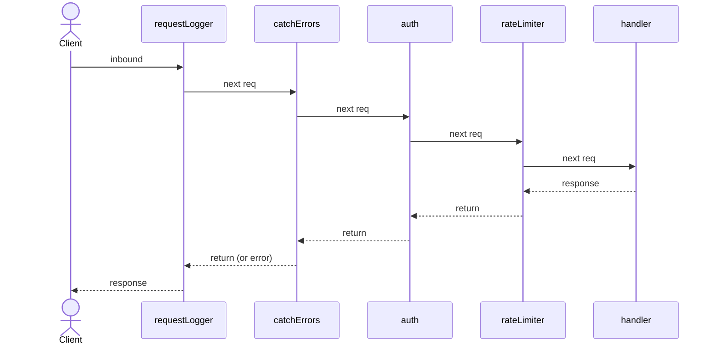

<div align="center">

# LeanIO

[](https://lean-lang.org/)
[](https://github.com/leanprover/lake)
[](./lakefile.toml)
[](./LICENSE)

A lightweight, composable HTTP router and server toolkit for Lean 4.

Built on `Std.Http.Server` with an axum-inspired extractor DSL,
middleware chaining, and sub-router mounting under path prefixes.

</div>

## Highlights

- 🧭 **Routing DSL** — term macros `GET`, `POST`, `PUT`, `DELETE`, `PATCH`, `HEAD`, `OPTIONS`, etc.
- 🔗 **Path extractors** — `Path Nat`, `Path (Nat × String)`, catch-all `Path String`
- 📦 **Body extractors** — `Json T` auto-deserializes with `FromJson`, `PlainText` for raw strings
- 📤 **Response dispatch** — `IntoResponse` maps return types to HTTP responses (String, JSON, status codes)
- 🌿 **Catch-all routes** — `{*rest}` captures the remainder of the path
- 🧩 **Sub-router mounting** — merge sub-routers under a prefix via `addRouter`
- 🧪 **Middleware chaining** — router, sub-router, and route-level middleware
- ⚡ **Optimized route matching** — routes and sub-routers pre-merged for fast lookup
- 🧪 **Tested** — unit tests + 16 integration tests

## Quick Start

```lean
import LeanIO
open LeanIO.Router

def hello := GET "/hello" =>
    "Hello, world!"

def main : IO Unit := Async.block do
  let addr : Net.SocketAddress := .v4 ⟨.ofParts 127 0 0 1, 8080⟩
  let router : Router := Router.empty
    |>.addRoute hello
    |>.addMiddleware requestLogger
    |>.addMiddleware catchErrors
  let server ← Server.serve addr router
  server.waitShutdown
```

Handlers return plain values — `String` becomes `200 text/plain`,
`ToJson` types become `200 application/json`, `()` becomes `204 No Content`.

## Route definitions

Routes are defined with term macros. Bind parameters with `(⟨pat⟩ : Extractor)`:

```lean
-- plain handler — returns a String
def hello := GET "/hello" =>
    "Hello, world!"

-- path parameter extraction
def getItem := GET "/items/{id}" (⟨id⟩ : Path Nat) => do
    return someItemDb.find id

-- JSON body extraction
def createItem := POST "/items" (⟨body⟩ : Json CreateItemRequest) => do
    return (Status.created, Item.of body)

-- combined: body + path params
def updateItem := PUT "/items/{id}" (⟨body⟩ : Json UpdateRequest) (⟨id⟩ : Path Nat) => do
    return Item.update id body

-- two path params
def getComment := GET "/items/{id}/comments/{cId}" (⟨id, cId⟩ : Path (Nat × Nat)) => do
    return Comment.find id cId

-- catch-all rest param
def serveFiles := GET "/files/{*rest}" (⟨rest⟩ : Path String) =>
    File.serve rest
```

Handlers run in `ContextAsync` — use `do` for async operations.

### Custom state extractors

Inject middleware state and extract it with `FromRequestParts`:

```lean
structure AppState where
  ref : IO.Ref Db
deriving TypeName

instance : FromRequestParts AppState where
  from_request_parts req :=
    match req.extensions.get AppState with
    | some s => .ok s
    | none   => .error "app state not installed"

def stateMiddleware := do
  let ref ← IO.mkRef defaultDb
  return withExtension AppState { ref }

def getData := GET "/data" (⟨s⟩ : AppState) => do
    let db ← s.ref.get
    return db.items
```

## Extractors

### Path parameters

| Pattern | Extractor | Description |
|---|---|---|---|
| `{id}` | `Path Nat` | Single typed param |
| `{a}/{b}` | `Path (Nat × String)` | Multiple params as tuple |
| `{a}/{b}` | `Path MyStruct` | Named params deserialized into a struct via `deriving FromPath` |
| `{*rest}` | `Path String` | Catch-all (must be last) |

The macro enforces a compile-time check: if the pattern has path parameters,
at least one binder must be a `Path` extractor.

### Body extractors

| Extractor | From | Validates |
|---|---|---|
| `Json T` | Request body | `Content-Type: application/json` + `FromJson T` |
| `PlainText` | Request body | `Content-Type: text/plain` |

### Built-in extractors

`FromRequestParts` instances for raw request metadata:

- `Method` — HTTP method (`GET`, `POST`, ...)
- `Version` — HTTP version
- `Headers` — request headers
- `URI.Path` — request path
- `URI.Query` — query string
- `RequestTarget` — full request URI

### Custom extractors

#### From request parts (sync)

```lean
class FromRequestParts (α : Type) where
  from_request_parts : Request Body.Stream → Except String α

instance : FromRequestParts ApiKey where
  from_request_parts req :=
    match req.line.headers.find? (mk "x-api-key") with
    | some (_, v) => .ok { key := v }
    | none         => .error "missing api key"
```

Use in handler: `(⟨key⟩ : ApiKey)`.

#### From request body (async)

```lean
class FromRequestBody (α : Type) where
  from_request_body : Request Body.Stream → ContextAsync (Except String α)

structure Xml (α : Type) where
  body : α

instance [FromXml α] : FromRequestBody (Xml α) where
  from_request_body req := do
    let raw ← req.body.readAll
    match Xml.parse raw with
    | .ok v => return .ok { body := v }
    | .error e => return .error e
```

Use in handler: `(⟨body⟩ : Xml T)`.

#### From string values (param parsing)

```lean
class FromString (α : Type) where
  parse : String → Except String α

instance : FromString Uuid where
  parse s := ...
```

Extends `Path α` parsing for new types: `Path Uuid` works
because `Path α` uses `FromString α` internally.

#### Deserializing path params into a struct (`FromPath`)

Use `deriving FromPath` on a structure to parse named path parameters
by field name instead of by position:

```lean
structure TodoIds where
  id  : Nat
  cId : Nat
deriving FromPath

def getComment := GET "/todos/{id}/comments/{cId}" (⟨ids⟩ : Path TodoIds) => do
    return Comment.find ids.id ids.cId
```

### Valid parameter names

Param names must start with a letter or `_` and contain only
alphanumeric characters or `_`. The pattern must start with `/`.

```lean
-- ✓ valid
GET "/user/{id}" ...
GET "/files/{*path}" ...
GET "/posts/{year}/{month}" ...

-- ✗ invalid — caught at compile time
GET "user/{id}" ...        -- no leading /
GET "/items/{*rest}/x" ... -- rest must be last
GET "/user/{1bad}" ...     -- param name starts with digit
```

## Responses

Return type | HTTP response
---|---
`String` | `200` text/plain
`Unit` / `()` | `200` empty body
`T` (with `ToJson T`) | `200` application/json
`Status × T` (with `ToJson T`) | given status + JSON body
`Except E T` | `.ok` → `IntoResponse T`, `.error` → `IntoResponse E`
`IO.Error` | `500` Internal Server Error

```lean
def created  := POST "/items" (⟨body⟩ : Json Item) => do
    let item ← Item.create body
    return (Status.created, item)    -- 201 Created + JSON

def notFound := GET "/items/{id}" (⟨id⟩ : Path Nat) => do
    match ← Item.find? id with
    | some item => return Except.ok item
    | none      => return Except.error (Status.notFound, ApiError.mk "not found")

def deleted  := DELETE "/items/{id}" (⟨id⟩ : Path Nat) => do
    Item.delete id
    return s!"Item {id} deleted"     -- 200 text/plain

def oops     := GET "/boom" =>
    throw <| IO.userError "bad"      -- 500 Internal Server Error
```

### Custom responses

Implement `IntoResponse` for your type:

```lean
class IntoResponse (α : Type) where
  into_response : ContextAsync α → ContextAsync (Response Body.Any)

instance : IntoResponse Html where
  into_response html := do
    let h ← html
    Response.ok
      |>.header (.mk "content-type") (.mk "text/html")
      |>.text (Html.render h)
```

Then handlers can return `Html` directly.

## Middleware

Middleware has type `HandlerSig → HandlerSig`:

```lean
def myMiddleware (next : HandlerSig) : HandlerSig := fun req => do
  IO.println s!"before: {req.line.uri.path}"
  let res ← next req
  IO.println s!"after: {res.line.status}"
  return res

def router : Router := Router.empty
  |>.addRoute myRoute
  |>.addMiddleware myMiddleware
```

Middleware can be added at three levels — route, sub-router, and router — using
Lean's pipe-builder idiom. The last middleware added wraps all earlier ones:

```lean
def todosRouter : Router := Router.empty
  |>.addRoute   (listTodos.addMiddleware rateLimiter)            -- route-level
  |>.addMiddleware auth                                          -- sub-router-level

def rootRouter : Router := Router.empty
  |>.addRouter     "/api/v1" todosRouter
  |>.addMiddleware catchErrors                                   -- inner
  |>.addMiddleware requestLogger                                 -- outermost, logs everything
```



Built-in middlewares:

| Middleware | Description |
|---|---|
| `requestLogger` | Logs method, path, and response time |
| `catchErrors` | Catches exceptions, returns 500 (customizable) |
| `auth` | Basic or bearer token authentication |
| `withExtension` | Inject state into extension |

## Router composition

Sub-routers are merged into the parent at construction time — each route's pattern
gets the mount prefix prepended. All dispatch is a single lookup.

```lean
def apiV1 : Router := Router.empty
  |>.addRoute listItems
  |>.addRoute createItem
  |>.addMiddleware apiAuth

def root : Router := Router.empty
  |>.addRouter "/api/v1" apiV1    -- merged into root with prefix prepended
  |>.addMiddleware requestLogger
```

Routes can also be inlined:

```lean
def apiV1 : Router := Router.empty
  |>.addRoute (GET "/hello" => "hi")
  |>.addRoute (POST "/echo" (⟨body⟩ : Json Pet) => return body)
```

## Requirements

- Lean `4.31.0`
- Lake

Toolchain is pinned in `lean-toolchain`.

## Installation

This repository is currently install-from-source.

1. Clone the repository.
2. Build the project:

```bash
lake build
```

3. Build and run the test target:

```bash
lake test
```

## Supported HTTP methods

Full list: `GET`, `POST`, `PUT`, `DELETE`, `PATCH`, `HEAD`, `OPTIONS`, `CONNECT`,
`TRACE`, `ACL`, `BIND`, `CHECKIN`, `CHECKOUT`, `COPY`, `LABEL`, `LINK`, `LOCK`,
`MERGE`, `MKACTIVITY`, `MKCALENDAR`, `MKCOL`, `MKREDIRECTREF`, `MKWORKSPACE`,
`MOVE`, `ORDERPATCH`, `PRI`, `PROPFIND`, `PROPPATCH`, `QUERY`, `REBIND`, `REPORT`,
`SEARCH`, `UNBIND`, `UNCHECKOUT`, `UNLINK`, `UNLOCK`, `UPDATE`,
`BASELINECONTROL`, `UPDATEREDIRECTREF`, `VERSIONCONTROL`

## License

MIT License. See [`LICENSE`](./LICENSE).
