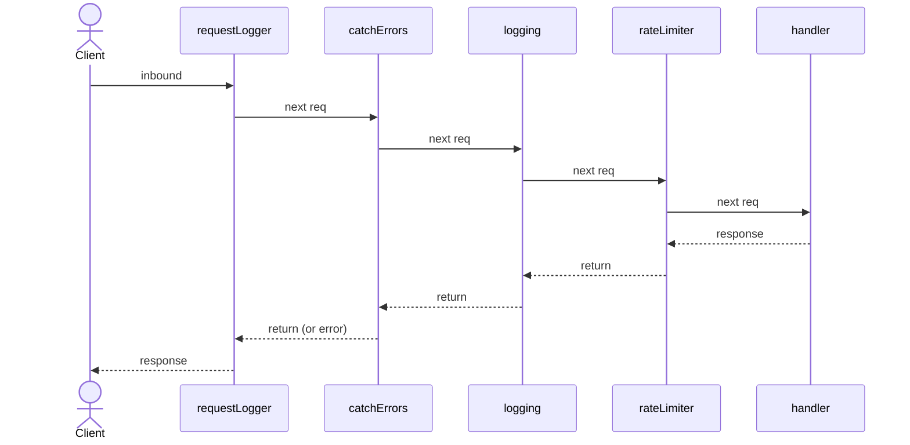

<div align="center">

# Leanio

[](https://lean-lang.org/)
[](https://github.com/leanprover/lake)
[](./lakefile.toml)
[](./LICENSE)

A lightweight, composable HTTP router and server toolkit for Lean 4.

Built on `Std.Http.Server` with a custom routing DSL, path-parameter extraction,
middleware chaining, and sub-router mounting under path prefixes.

</div>

## Highlights

- 🧭 **Routing DSL** — term macros `GET`, `POST`, `PUT`, `DELETE`, `PATCH`, `HEAD`, `OPTIONS`, etc.
- 🔗 **Path parameters** — typed extraction with `{param}` syntax (`Nat`, `Int`, `String`, `Bool`, `Float`)
- 🌿 **Catch-all routes** — `{*rest}` captures the remainder of the path
- 🧩 **Sub-router mounting** — merge sub-routers under a prefix via `addRouter`
- 🧪 **Middleware chaining** — router, sub-router, and route-level middleware
- 📦 **JSON body parsing** — automatic `FromJson` deserialization for request bodies
- 📤 **JSON response helpers** — `Response.json`, `.created`, `.notFound`, `.badRequest`
- ⚡ **Optimized route matching** — routes and sub-routers pre-merged for fast lookup
- 🧪 **Tested** — unit tests + integration tests for the full CRUD API

## Quick Start

```lean
import Leanio
open Leanio.Router

def hello := GET "/hello" (req : Request Body.Stream) =>
    Response.ok |>.text "Hello, world!"

def main : IO Unit := Async.block do
  let addr : Net.SocketAddress := .v4 ⟨.ofParts 127 0 0 1, 8080⟩
  let router : Router := Router.empty
    |>.addRoute hello
  let server ← Server.serve addr router
  server.waitShutdown
```

## Route definitions

Routes are defined with term macros. Each expands to a `Route` value — they can be
named or inlined directly into a router:

```lean
def listItems := GET "/items" (req : Request Body.Stream) =>
    -- raw stream body access

def createItem := POST "/items" (req : Request CreateItemRequest) =>
    -- req.body auto-parsed from JSON as CreateItemRequest

def getItem := GET "/items/{id}" (req : Request Body.Stream) (id : Nat) =>
    -- id extracted from the path and parsed as Nat

def updateItem := PUT "/items/{id}" (req : Request UpdateItemRequest) (id : Nat) =>
    -- both path params and JSON body parsing

def serveFiles := GET "/files/{*rest}" (req : Request Body.Stream) (rest : String) =>
    -- rest captures everything after /files/ as a single string
```

`Request Body.Stream` keeps the request body raw. `Request T` where `T` derives
`FromJson` auto-deserializes the body and returns `400 Bad Request` on failure.

### Runtime construction

When the handler is pre-built and no macro-time processing is needed:

```lean
def myHandler : HandlerSig := fun req => do
  let params := (req.extensions.get Leanio.Router.RouteParams).getD { values := #[] }
  let id := match params.values.get? 0 with | some n => n | none => "unknown"
  Response.ok |>.text s!"user {id}"

def myRoute : Route := Route.new .get "/user/{id}" myHandler
```

Prefer the term macros — they validate patterns and extract params at compile time.

## JSON Serialization

### Defining request and response types

Leanio uses Lean's `FromJson` and `ToJson` typeclasses for automatic JSON handling.

```lean
structure CreateUserRequest where
  name  : String
  email : String
  age   : Nat
deriving FromJson

structure UserResponse where
  id    : Nat
  name  : String
  email : String
  age   : Nat
deriving ToJson
```

### Receiving JSON in request bodies

```lean
def createUser := POST "/users" (req : Request CreateUserRequest) => do
    let name  := req.body.name
    let email := req.body.email
    Response.json s!"created user {name}"
```

Malformed JSON returns `400 Bad Request` automatically.

### Sending JSON in responses

```lean
def getUser := GET "/users/{id}" (req : Request Body.Stream) (id : Nat) =>
    let user : UserResponse := { id, name := "Alice", email := "a@b.com", age := 30 }
    Response.json user
```

Status helpers:

```lean
Response.json user              -- 200 OK
Response.json.created user      -- 201 Created
Response.json.badRequest msg    -- 400 Bad Request
Response.json.notFound msg      -- 404 Not Found
```

### Full JSON CRUD example

```lean
import Leanio.Router
open Leanio.Router

structure Pet where
  id   : Nat
  name : String
deriving ToJson

structure CreatePetRequest where
  name : String
deriving FromJson

def listPets := GET "/pets" (req : Request Body.Stream) =>
    Response.json #[Pet.mk 1 "Fluffy", Pet.mk 2 "Spot"]

def createPet := POST "/pets" (req : Request CreatePetRequest) =>
    let pet := Pet.mk 3 req.body.name
    Response.json.created pet

def updatePet := PUT "/pets/{id}" (req : Request CreatePetRequest) (id : Nat) =>
    let updated := Pet.mk id req.body.name
    Response.json updated

def deletePet := DELETE "/pets/{id}" (req : Request Body.Stream) (id : Nat) =>
    Response.ok |>.text s!"pet {id} deleted"
```

## Router composition

Sub-routers are merged into the parent at construction time — each route's pattern
gets the mount prefix prepended. All dispatch is a single lookup.

```lean
def apiV1 : Router := Router.empty
  |>.addRoute listItems
  |>.addRoute createItem
  |>.addMiddleware apiAuth

def root : Router := Router.empty
  |>.addRouter "/api/v1" apiV1    -- merged into root with prefix prepended
  |>.addMiddleware requestLogger
```

Routes can also be inlined:

```lean
def apiV1 : Router := Router.empty
  |>.addRoute (GET "/hello" (req : Request Body.Stream) => Response.ok |>.text "hi")
  |>.addRoute (POST "/echo" (req : Request CreatePetRequest) => Response.json req.body)
```

## Middleware

Middleware has type `HandlerSig → HandlerSig`:

```lean
def myMiddleware (next : HandlerSig) : HandlerSig := fun req => do
  IO.println s!"before: {req.line.uri.path}"
  let res ← next req
  IO.println s!"after: {res.line.status}"
  return res

def router : Router := Router.empty
  |>.addRoute myRoute
  |>.addMiddleware myMiddleware
```

Middleware can be added at three levels — route, sub-router, and router — using
Lean's pipe-builder idiom. The last middleware added wraps all earlier ones:

```lean
def todosRouter : Router := Router.empty
  |>.addRoute   (listTodos.addMiddleware rateLimiter)            -- route-level
  |>.addMiddleware logging                                      -- sub-router-level

def rootRouter : Router := Router.empty
  |>.addRouter     "/api/v1" todosRouter
  |>.addMiddleware catchErrors                                  -- inner
  |>.addMiddleware requestLogger                                -- outermost, logs everything
```



State injection via extensions:

```lean
structure AppState where
  ref : IO.Ref MyData
deriving TypeName

def stateMiddleware := do
  let ref ← IO.mkRef { ... }
  return withExtension AppState { ref }

let router := rootRouter
  |>.addMiddleware (← stateMiddleware)
```

Extract in handlers:

```lean
def getData := GET "/data" (req : Request Body.Stream) => do
    match req.extensions.get AppState with
    | some state => do
      let data ← state.ref.get
      Response.json data
    | none => Response.internalServerError |>.text "no state"
```
## Requirements

- Lean `4.31.0`
- Lake

Toolchain is pinned in `lean-toolchain`.

## Installation

This repository is currently install-from-source.

1. Clone the repository.
2. Build the project:

```bash
lake build
```

3. Build and run the test target:

```bash
lake test
```

## Supported HTTP methods

Full list: `GET`, `POST`, `PUT`, `DELETE`, `PATCH`, `HEAD`, `OPTIONS`, `CONNECT`,
`TRACE`, `ACL`, `BIND`, `CHECKIN`, `CHECKOUT`, `COPY`, `LABEL`, `LINK`, `LOCK`,
`MERGE`, `MKACTIVITY`, `MKCALENDAR`, `MKCOL`, `MKREDIRECTREF`, `MKWORKSPACE`,
`MOVE`, `ORDERPATCH`, `PRI`, `PROPFIND`, `PROPPATCH`, `QUERY`, `REBIND`, `REPORT`,
`SEARCH`, `UNBIND`, `UNCHECKOUT`, `UNLINK`, `UNLOCK`, `UPDATE`,
`BASELINECONTROL`, `UPDATEREDIRECTREF`, `VERSIONCONTROL`

## License

MIT License. See [`LICENSE`](./LICENSE).
